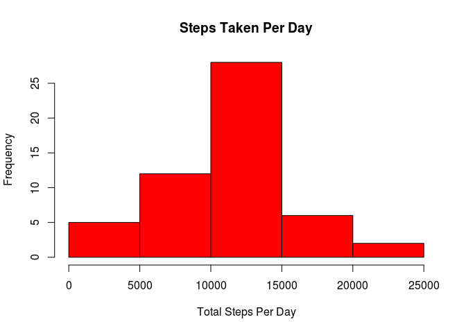
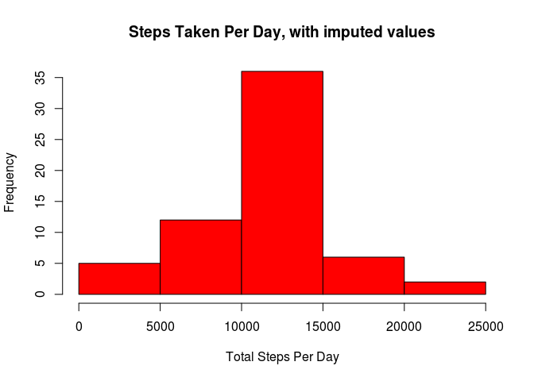
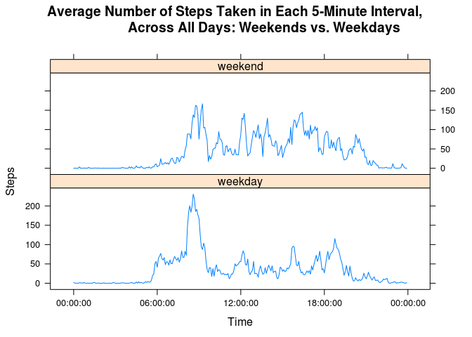

# Reproducible Research: Peer Assessment 1

## Loading and preprocessing the data

After the data is loaded, the interval variable was converted to a time format and then combined with the date variable in order to create a date-time variable. The timeFun function below takes a interval value and performs integer division (%/%) to determine the hour (e.g. 835 %/% 100 = 8).  The timeFun also uses the modulo operation (%%) to determine the number of minutes (e.g. 835 %% 100 = 35).


```r
library(lattice)
library(lubridate)

ActivityData <- read.csv("activity.csv", header=TRUE)

#This funtion is for the interval column. It takes a value, perform modulus and
#integer division by 100 on the value, and returns a string of %H:%M:%S format.
timeFun <- function(x){
        h <- x %/% 100
        m <- x %% 100
        sprintf("%02d:%02d:00", h, m)
}
#Apply the timeFun function to the interval column and create a new time column
ActivityData$time <- timeFun(ActivityData$interval)

#Create a dateTime column of POSIXlt class by merging the date and time columns
ActivityData$dateTime <- as.POSIXlt(paste(ActivityData$date, ActivityData$time, 
                                          sep = " "))
```


## What is mean total number of steps taken per day?
The first step below aggregates the data frame into a new data frame by summing the steps by date.  After that, the table is used to create a histogram of the total number of steps taken each day.  The table was also used to determine the mean and median steps taken per day. The mean number of steps taken is 10766 and the median number of steps taken is 10765. 


```r
#Make a histogram of the total number of steps taken each day
daySteps <- aggregate(steps~date, data = ActivityData, sum)

hist(daySteps$steps, col = "red", main = "Steps Taken Per Day",
     xlab = "Total Steps Per Day")
```

 

```r
#Calculate the mean and median total number of steps taken each day
mean(daySteps$steps)
```

```
## [1] 10766
```

```r
median(daySteps$steps)
```

```
## [1] 10765
```


## What is the average daily activity pattern?

Below is a time-series plot of the 5-min interval and the average number of steps taken, averaged across all days. To build the graph, the first step is to find the mean of each five-minute interval across all of the days.  After obtaining a new data frame that contains only the interval and the mean number of steps for each interval, the interval variable is converted to a date-time variable for clarity when graphing.  Note: The strptime function also applies a date to the the new time variable.  That date in the AvgIntvlSteps data frame should be ignored.  The five minute interval, averaged across all of the days in the data set, that contains the maximum number of steps is interval 835, which is 8:35 am.


```r
#Calculate the average number of steps taken, averaged across all days, for each five minute interval and create a time series plot of the five minute interval and the average number of steps taken, averaged across all days
AvgIntvlSteps <- aggregate(steps~interval, data = ActivityData, mean)

#Convert the interval variable to a date-time variable for clarity when plotted
AvgIntvlSteps$time <- timeFun(AvgIntvlSteps$interval)
AvgIntvlSteps$time <- strptime(AvgIntvlSteps$time, format = "%T")

#Create the plot
plot(AvgIntvlSteps$time, AvgIntvlSteps$steps, type="l",
     main = "5-Minute Interval Average Number of Steps Taken, Across All Days", 
     xlab = "Time", ylab = "Average Steps Taken")
```

 

```r
#Which 5-min interval, on average across all the days in the dataset, contains the maximum number of steps?
MaxSteps <- max(AvgIntvlSteps$steps)

MaxIntvlRow <- AvgIntvlSteps[AvgIntvlSteps$steps == MaxSteps,]

MaxIntvlRow[,1]
```

```
## [1] 835
```


## Imputing missing values

There are 8 days of missing data for a total of 2304 missing values in the data frame. In order to create a data set without missing values, the missing values were imputed using the number of steps taken in each five minute interval, averaged across all of the days. 

From the new data set, a histogram of total number of steps taken each day is created.  The mean number of steps taken each day is 10766, which is the same as in the data set without the imputed values.  The median number of steps taken each day is also 10766, which is different from the original data set. In the original data set, the median was 10765 and the mean was 10766.  Adding 8 days worth of data that was imputed by using the mean interval values would naturally pull the median up toward the mean.


```r
#Calculate and report the total number of missing values in the dataset
missing <- colSums(is.na(ActivityData))
missing[1]
```

```
## steps 
##  2304
```

```r
#Days for which data is missing and count of missing intervals
DaysMissing <- ActivityData[is.na(ActivityData$steps),]
xtabs(is.na(DaysMissing$steps) ~ DaysMissing$date, drop.unused.levels = TRUE)
```

```
## DaysMissing$date
## 2012-10-01 2012-10-08 2012-11-01 2012-11-04 2012-11-09 2012-11-10 
##        288        288        288        288        288        288 
## 2012-11-14 2012-11-30 
##        288        288
```

```r
#Create a new dataset to be modified
ImpActData <- ActivityData

#Impute missing values using the number of steps taken, averaged across all days, in each five minute interval.
for (i in 1:nrow(ImpActData)) {
    if (is.na(ImpActData$steps[i])) {
        AvgIntvl <- ImpActData$interval[i]
        AvgIntvlRow <- AvgIntvlSteps[AvgIntvlSteps$interval == AvgIntvl,]
        ImpActData$steps[i] <- AvgIntvlRow$steps
    }
} 

#Make a histogram of total number of steps taken each day using the new dataframe
daySteps2 <- aggregate(steps~date, data = ImpActData, sum)

hist(daySteps2$steps, col = "red", 
     main = "Steps Taken Per Day, with imputed values",
     xlab = "Total Steps Per Day")
```

 

```r
#Calculate the mean and median number of steps taken each day using the new dataframe
mean(daySteps2$steps)
```

```
## [1] 10766
```

```r
median(daySteps2$steps)
```

```
## [1] 10766
```


## Are there differences in activity patterns between weekdays and weekends?

Using the data set with the filled-in missing values, a new factor variable is created with two levels – “weekday” and “weekend”, and then used in a time series panel plot of the five minute interval and the average number of steps taken, averaged across all weekday days or weekend days.

The time series plot below that compares the five minute interval, averaged across all of the days of weekends and weekdays shows that there is generally a difference. The weekends have more movement spikes throughout the day, while the weekday is generally flatter after the morning spike of activity.


```r
#Create a variable that indicates the day of the week
ImpActData$weekdays <- wday(ImpActData$dateTime, label=TRUE)

#Create a variable that indicates weekday or weekend
ImpActData$weekend <- ifelse(ImpActData$weekdays %in% c("Sat","Sun"), 
                             "weekend", "weekday")

#Calculate the five minute interval and the average number of steps taken, averaged across all weekday days or weekend days
AvgIntvlSteps2 <- aggregate(steps~interval + weekend, data = ImpActData, mean)

#Convert the interval variable to a date-time variable for clarity in the plot
AvgIntvlSteps2$time <- timeFun(AvgIntvlSteps2$interval)
AvgIntvlSteps2$time <- as.POSIXct(strptime(AvgIntvlSteps2$time, format = "%T"))

#Create the time series plot
xyplot(steps ~ time | weekend, data = AvgIntvlSteps2, type = "l",
       scales = list(x = list(format = "%T")),
       main = "Average Number of Steps Taken in Each 5-Minute Interval, 
                Across All Days: Weekends vs. Weekdays",
       xlab = "Time", ylab = "Steps", layout = c(1, 2))
```

 
